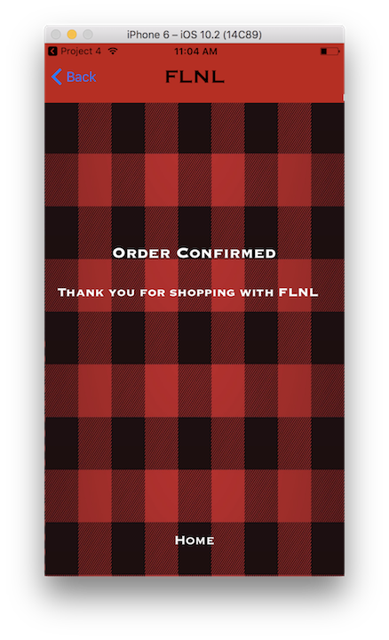

# Project-4
FLNL is an e-commerce marketplace for Lumbersexuals (those who aspire to dress or live the Lumberjack lifestyle). 

##Screenshots
  

##Key Technology Used
There were many components that went into the building of Oliver. Below are a few of the key components that make things run under the hood:

* Firebase Database
* User Authentication
* iPhone Native Camera Access
* Image Storage
* Core Data
* Notifications

Cocoapods include:

	1. Firebase Messaging
	2. Firebase Storage
	3. Firebase Database
	4. Firebase Authentication

##Hurdles

* Assiging multiple images to an item and waiting for Firebase to load them before moving on
* Persisting everything in CoreData
* Connecting Vendors, Items, and Images through a No SQL Database

##Still To Come

* Many more notifications
* Refining the UI for shoppers
* Image compression for faster loading 

